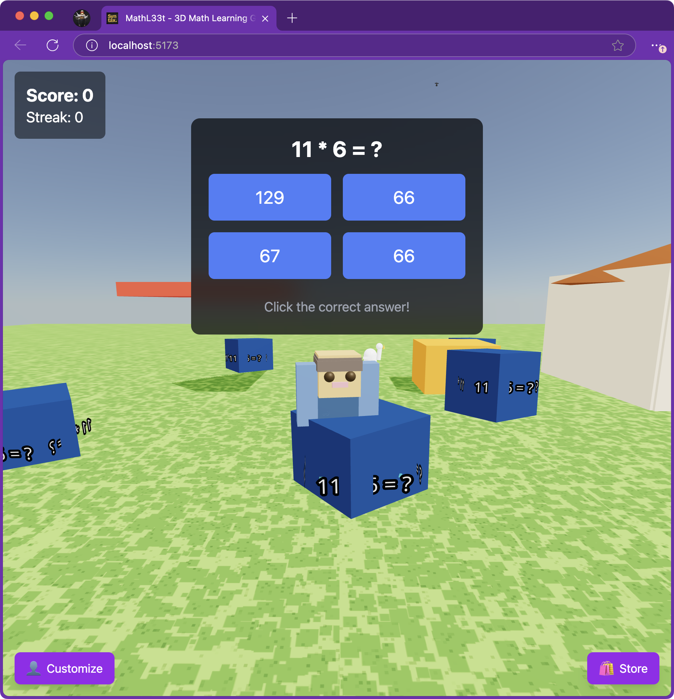

# Mathl33t

A 3D world math game that isn't very good. Obnoxiously vibe coded with AI.

You can play it at [https://mathl33t.com](mathl33t.com)

To dev: `npm install` then `npm run dev`. To build `npm run build`.

## Features wanted

I need to find time to type these into the AI

1. Realtime + multi-player
1. Sometimes the characters get their neck stuck on the blocks
1. Persist score
1. Better + more questions.
1. ability to select the difficulty level
1. Make it better
